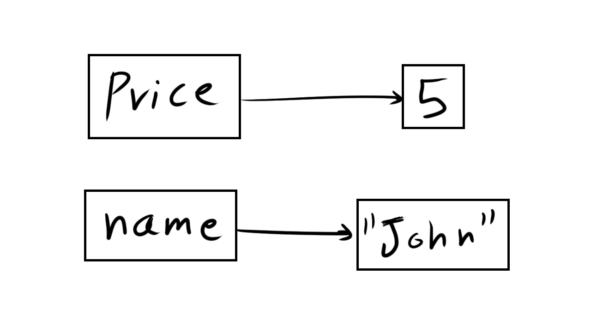

<!-- .slide: id="lesson2" -->

# Basic Frontend - Spring 2023

Lesson 2, Tuesday, 2023-03-21

---


### Recap

Can you tell me, what did we talk about last lesson?

---


### Recap: Javascript Console

`F12` is the magic word

---


### Recap: data types

Number:
```js
42
-3.1415
```


We can also do some computations
<!-- .element: class="fragment" -->

```js
1 + 1

10 / 5

5 ** 3
```
<!-- .element: class="fragment" -->


---

### Recap: data types


String:
```js
"John"
'Berlin'
```

---

### String operators

The addition operator (`+`) can be used to add (concatenate) two strings:

```js
"a" + "b"    // results: "ab"
```

---

### String operators

The addition operator can be used on Strings and Numbers:

```js
1 + 1                // is 2
"hello" + " world"   // is "hello world"
```

---

### Importance of data types

```js
1 + 1        // is 2
"1" + "1"    // is "11"
```

It is important to select the appropriate data type for your data, as the behavior of operators in JavaScript varies depending on the data type used.

---

### Quick exercise

use the `+` operator to combine multiple strings to match the following sentence:


Hello, my name is + (name) + and I like + (food)

---


### String operators

We shouldn't use other operators (like `-`, `/`, `*`) on strings, while javascript may allow that, the results are unexpected, with strings, we should only use `+`.

---

### Data Type: Boolean

* **Boolean** describes a yes/no situation
* in JavaScript, we use `true` or `false`

---

### Practice

Open the console, and type in the following:

* `true`
* `false`

Why would we dedicate an entire data type for just two values?
<!-- .element: class="fragment" -->

---


### Comparison operators

* `===` strict equality

```js
1 === 1     // true
3 === 10    // false

3 === "Hello"  // false
3 === "3"      // false

"Harald" === "Harald" // true
"Harald" === "Sevtap" // false
"Abdo" === "abdo"     // false
```

---


### Comparison operators

* `!==` strict inequality


```js
3 !== 5           // true
3 !== 3           // false
1 !== "Cookies"   // true
```

---

### Comparison operators

We can use `===` and `!==` to test for the equality and inequality of any 2 values in javascript.


---

### Quick exercise

Use the equality comparison operators to generate boolean values for these questions:

* is your favorite food Pizza?
* are you 25 years old?
* is "Friends" your favorite tv series?
* is 40 your shoe size?

As an example for the first item on this list, my favorite food is Döner:

```js
"Pizza" === "Döner"  // false
```


---

### Comparison operators

There are a couple of operators that we can use for numbers only

* `>` greater than
* `<` less than
* `>=` greater or equal
* `<=` less or equal

---


```js
1 > 0 // true
1 > 5 // false
```

```js
10 < 20 // true
10 < 5 // false

```
<!-- .element: class="fragment" -->


```js
42 >= 40 // true
42 >= 42 // true
42 >= 50 // false
```
<!-- .element: class="fragment" -->


---

### Comparison operators

* `===` strict equality
* `!==` strict inequality
* `>` greater than
* `<` less than
* `>=` greater or equal
* `<=` less or equal

All of these can only return `true` or `false`

---


### Summary

So far, we learned how to enter data and how to use operators to derive new data.

But when reading the code we wrote, we won't quite understand it later:

```js
4 * 8
32 / 2
```

What do you think these number mean?

---

<!-- .slide: id="variables" -->
# Variables


---

### Variable

A pointer to value.

```js
let price = 5;
let name = "John";
```



<!-- .element: style="text-align:center; height: 400px" -->


---

### Examples:

```js
let priceCoffee = 2;
let priceCappuccino = 3;
let customer = "John";
let greeting = "Hello";
let likesCarlo = true;
let hasKids = false;
```

Can you guess how we can define a variable?

---

### How do we define a variable?

We write:
* `let`
* the variable name
* `=`
* the value we want
* `;`

---

### Variables are variable

You can change the value of a variable using the assignment operator (`=`):

```js
let temperature = 24;   // define a variable, initialize it to 24
temperature = 30;       // assign a new value (30) to the variable
temperature = 23;       // now temperature is 23
```

We define a variable once, then we can change it as often as needed.


---

### try it!

Create some variables:

* one for your full name
* one for your age
* one for your favorite city
* one for whether you can speak German or not
* and anything else you can think of :)

In the JavaScript console, enter the name of the variable. Do you see its value?

Bonus: Change the value of one of the variables that you defined.


---

### Variables

Variables can be used wherever we can use values:

```js
let pricePerTicket = 8;
let friends = 3;
let totalPrice = friends * pricePerTicket;
```


---

### Why do we use variables?

We use variables

* to give names (meaning) to values. `42` could mean a person’s age or shoe size.
* to avoid repetitions. We define the variable once with a value, and use it often.

---

### Variable names

You can name your variables in a lot of ways:

* You can use letters, numbers, and underscore _ (spaces are *not* allowed!)
* Variable name cannot start with a number.

Valid variable names:
```js
let element = 3;
let element3 = 5;
```

Invalid variable names:
```js
let 2squared = 4;
let element-1 = 0;
let full name = 'Anakin Skywalker';
```

---

Giving good and descriptive names to your variables is very important!

Good variable names make the code easier to understand by other developers, and even by yourself!

Valid but not very descriptive variable names:

```js
let a = 0;
let _12 = 0;
let asldjf = 0;
let thisisareallylongvariablename = 0;
```

---

In this course, and JavaScript in general, we use 'camelCase':

- `isStudent`
- `favoriteBook`
- `likesGermanFood`

---

Variable names are case sensitive:

```js
let name = 'John';
let Name = 'John';
let NAME = 'John';
```

These are 3 different variables.


---


### Practice

Let's say we want to go to the cinema with some friends (choose any number).

How many people are going to the cinema in total? Create a variable for that.
<!-- .element: class="fragment" -->

A ticket to watch the movie costs 12.5€, create a variable for this as well.
<!-- .element: class="fragment" -->

Create a new variable that contains how much we have to pay in total.
<!-- .element: class="fragment" -->


Harald and Woytek volunteered to pay for the tickets. Use JavaScript to compute how much each has to pay.
<!-- .element: class="fragment" -->


---

# Logical Operators

---

### Logical Operators

These operators work on `boolean` values:

* `&&` AND
* `||` OR
* `! ` NOT

---

### Logical NOT !

Logical NOT negates a boolean:

```javascript
!true  // false
!false // true
```

---

Example:

```js
let hatesPineapple = false;
let canEatPizzaHawaii = !hatesPineapple;
```

---

### Quiz - Do we go biking or swimming?

```js
let temperature = 28;
let isWarm = temperature > 25;
let goSwimming = isWarm;
let goBiking = !isWarm;
```

Answer: we go swimming <!-- .element: class="fragment" -->

---

### Try to prevent double negations

```js
let isNotWarm = temperature <= 25;
let goSwimming = !isNotWarm; // No. Just no. Please Don't.
```

Better:

```js
let isWarm = temperature > 25;
let goSwimming = isWarm;
```

---

### Logical AND &&

AND takes two booleans and returns `true` if **both** booleans are `true`

```js
true  && true   // true
true  && false  // false
false && true   // false
false && false  // false
```

---

### Example - AND &&

I need bread **and** cheese to make a cheese toast

```js
let hasCheese = true;
let hasBread = true;
let canMakeCheeseToast = hasCheese && hasBread;
// what's the value of canMakeCheeseToast ?
```

`true` <!-- .element: class="fragment" -->

---

### Logical OR ||

OR takes two booleans and returns `true` if **at least one** is `true`

```js
true  || true   // true
true  || false  // true
false || true   // true
false || false  // false
```

---

### Example - OR ||

To apply to a job, I need to know German **or** English

```js
let knowsGerman = false;
let knowsEnglish = false;
let canApply = knowsGerman || knowsEnglish;
// what's the value of canApply?
```

`false` <!-- .element: class="fragment" -->

---

### Task

A job add requires JavaScript or Python knowledge. Can you finish the code below?

```js
let canProgramJavaScript = true;
let canProgramPython = true;
let canApply = // ???
```

---

### Task

```js
let pricePerTicket = 8;
let friends = 3;
let totalPrice = friends * pricePerTicket;
```

* Copy/paste this code and look at the `totalPrice` variable in the console.
* Add a new variable that points to the price of popcorn (7 EUR).
* Can you add the price for one popcorn to the `totalPrice` variable?
* Create a new variable containing your total budget (30 EUR).
* Create a new variable that is `true` if the budget is high enough for cinema, `false` otherwise.
* BONUS: Create a new variable `isCheap` that is `true` if the price of popcorn is less than 5 EUR and the price for a ticket is less than 7 EUR.

<!-- .slide: style="font-size:80%" -->

---

### Solution

A job add requires JavaScript or Python knowledge. Can you finish the code below?

```js
let canProgramJavaScript = true;
let canProgramPython = true;
let canApply = canProgramJavaScript || canProgramPython;
```

---

```js
let pricePerTicket = 8;
let friends = 3;
let totalPrice = friends * pricePerTicket;
let popcornPrice = 7;
totalPrice = totalPrice + popcornPrice;
let budget = 30;
let enoughMoney = budget >= totalPrice;
let isPopcornCheap = popcornPrice < 5;
let isTicketCheap = pricePerTicket < 7;
let isCheap = isPopcornCheap && isTicketCheap;
```
