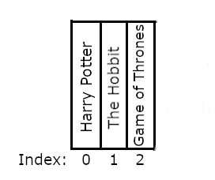

<!-- .slide: id="lesson6" -->

# Basic Frontend - Spring 2023

Lesson 6, Tuesday, 2023-04-04

<!-- This references the lesson 13 from js-berlin-2022-fall, removing loop references -->

---

### Lesson Overview

* Review `undefined` and `null` data types
* Compound Assignment Operators
* Arrays
* Practice

---

### Quiz

What's the value of `banana`?

```js
let banana;
```

`undefined`
<!-- .element: class="fragment" -->

---

### Quiz

What is the difference between `banana` and `emptyValue` values?

```js
let banana;
let emptyValue = null;
```

`banana` is unintentially absent of value and `emptyValue` is intentionally absent of value (we coded it to be `null`)
<!-- .element: class="fragment" -->

---

### Quiz

What's going to be printed in the console in the end? What's the final value of `sum`?

```js
let sum = 0;
sum = sum + 2;
sum += 10;
console.log("total:", sum * 2);
```

The console will print: `total: 24` and the value of `sum` is `12`.
<!-- .element: class="fragment" -->

---

### Arrays

An `array` is a container type that holds multiple values:

```js
// we create an empty array using []
let emptyArray = [];

// we put the values we want in square brackets
// separated by commas
let ages = [19, 33, 25, 40];
let cities = ["London", "Paris", "Berlin"];
```

---

Array can hold any type of value:

```js
let prices = [0.99, 1.49];
```

And any quantity:
```js
// I only have one favorite food
let favoriteFoods = ["Pizza"];
// An array holding 26 letters of the alphabet
let alphabet = ["a", "b", "c", "d", "e", "f", "g", "h", "i", "j", "k", "l"]; //TODO
```

---

### Analogy: Bookshelf

A bookshelf can be thought of as an array of books


```js
let books = ["Harry Potter", "The Hobbit", "Game of Thrones"];
```

---

### Other analogies?

Can you think of other analogies for arrays?

- a todo list
<!-- .element: class="fragment" -->
- a shopping list
<!-- .element: class="fragment" -->
- ingredients in a recipe
<!-- .element: class="fragment" -->
- the students in this class
<!-- .element: class="fragment" -->
- the numbers from 1 to 10
<!-- .element: class="fragment" -->
- a set of random numbers
<!-- .element: class="fragment" -->

---

### Accessing elements

We can access elements in the array by number using square brackets "`[]`"

The numbering starts at `0` (think floors of a building):

```js
let books = ["Harry Potter", "The Hobbit", "Game of Thrones"];

console.log(books[0]); // "Harry Potter"
console.log(books[1]); // "The Hobbit"

// QUIZ - how do we access "Game of Thrones" ?
```

```js
console.log(books[2]); // "Game of Thrones"
```
<!-- .element: class="fragment" -->
The order of elements in the array matters!
<!-- .element: class="fragment" -->


---

### Bookshelf array



---

### Invalid elements

```js
let books = ["Harry Potter", "The Hobbit", "Game of Thrones"];

console.log(books[0]); // "Harry Potter"
console.log(books[1]); // "The Hobbit"
console.log(books[2]); // "Game of Thrones"
console.log(books[3]); // ???
```

```js
console.log(books[3]); // undefined
```
<!-- .element: class="fragment" -->

---

### Quiz

```js
let friends = ["Alice", "Bob", "Carol"];

console.log(friends[1]); // ???
console.log(friends[3]); // ???
```

```js
console.log(friends[1]); // "Bob"
console.log(friends[3]); // undefined
```
<!-- .element: class="fragment" -->

---

### Task 1

* Step 1: Create an array with your 3 top friends
* Step 2: Say "hello" on console to each friend, e.g.:

```plaintext
hello Alice
hello Bob
hello Carol
```

---

### Task 1: solution

```js
let friends = ["Sevtap", "Carlo", "Abdullah"];
console.log("hello " + friends[0]);
console.log("hello " + friends[1]);
console.log("hello " + friends[2]);
```

---

### Modifying arrays

We can change any value using brackets:

```js
let friends = ["Alice", "Bob", "Carol"];

friends[1] = "David";
// friends array is now ["Alice", "David", "Carol"]

console.log(friends[1]); // "David"
```

---

### Common operations: array length

We can get the length of an array with the `.length` property:

```js
let friends = ["Alice", "Bob", "Carol"];
console.log(friends.length); // 3
```

---

### Appending new values

We can append new values to an array using `.push()`:

```js
let friends = ["Alice", "Bob", "Carol"];
console.log(friends.length); // 3

friends.push("David");

console.log(friends.length); // 4
console.log(friends[3]); // David
```

---

### Task 1
Create an array of friends (any number more than 3). Calculate the total price of the show (costs 7 euros each ticket).

It is the birthday of the last friend.

- The first friend will pay half of the total price.
- The remaining will pay the other half.
- The last person pays nothing.

Console log:

```
"Person 1 pays x"
"The others pay y each"
"Congratulations Person last!"
```

---

### Task 2
Let's say your last friend had a fight with you and now you want to update your array and change their name to a generic "Karen".
Update your list with the new friend.

Second, you met a new friend and want to add them to your list. Update your array and log: `Welcome, <person name> to our group of friends!`
