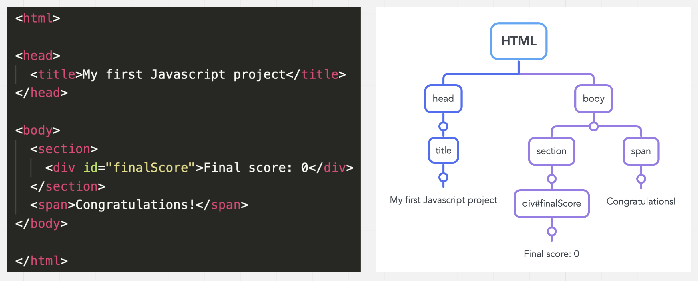

<!-- .slide: id="lesson11" -->

# Basic Frontend - Spring 2023

Lesson 11, Thursday, 2023-04-20

---

### Lesson overview

* Homework questions?
* Recap: Functions
* Manipulating HTML - DOM

---

### Recap

- Function declaration and execution
- Parameters and arguments
- Returning values

---

### Quiz 1

How do I **declare or define** a function?

```js
function sum() {
  // do something
}
```
<!-- .element: class="fragment" -->

---


### Quiz 2

How do I **call or execute** this function?

```js
function sum() {
  // do something
}
```

```js
sum();
```
<!-- .element: class="fragment" -->

---

### Quiz 3

How do I add two **parameters** to this function?

```js
function sum() {
  // do something
}
sum();
```

```js
function sum(numberOne, numberTwo) {
  // do something
}
```
<!-- .element: class="fragment" -->

---

### Quiz 4

How do I add pass **arguments** to this function?

```js
function sum(numberOne, numberTwo) {
  // do something
}
sum();
```

```js
sum(2, 3);
```
<!-- .element: class="fragment" -->

---

### Quiz 5

How do I **return** the sum of the two parameters and store in a variable?

```js
function sum(numberOne, numberTwo) {
  // do something
}
sum(2, 3);
```

```js
function sum(numberOne, numberTwo) {
  return numberOne + numberTwo;
}

let finalScore = sum(2, 3);
```
<!-- .element: class="fragment" -->

---

### Manipulate HTML Elements from JavaScript

Let's say we have a HTML element:

```html
<div>Final score: 0</div>
```

Wouldn't it be nice if we could dynamically change that from JavaScript?

---

<!-- .slide: id="get-element" -->

### document.getElementById

One way to obtain a variable pointing to a HTML element is `document.getElementById()`:

HTML:

```html
<div id="finalScore">Final score: 0</div>
```

JavaScript:

```js
let finalScoreDiv = document.getElementById("finalScore");
```

---

`finalScoreDiv` is a variable, and its type is `object`.

How do we know which properties/methods the object has?

We could try the browser's developer tools.

Or we could check MDN:

https://developer.mozilla.org/en-US/docs/Web/API/HTMLDivElement


---

### DOM - Document Object Model

How can HTML and JavaScript communicate?

There is an interface called DOM, which communicates the HTML to a nested **object** structure.

---



---

Let's try some properties, see what happens:

```js
let finalScoreDiv = document.getElementById("finalScore");

// choose from below:
// finalScoreDiv.textContent = "Hi from JavaScript";
// finalScoreDiv.hidden = true;
// finalScoreDiv.style.backgroundColor = "red";
// finalScoreDiv.remove();
```

---

### Interacting with buttons

HTML Buttons have a `onclick` attribute that executes JavaScript when the button is clicked:

```html
<button onclick="console.log('I was clicked!')">
  Click me!
</button>
```

However, writing JavaScript in `onclick` is rather tedious. Can you think of a better way?

---

How about calling a function instead?

```html
<button onclick="handleButtonClick()">Click me!</button>
```

In JavaScript:

```js
function handleButtonClick() { /* TODO */ }
```

---

### Example: Changing the background color

The browser provides a value in `document.body.style.backgroundColor` of every HTML element.

We can assign a new one to `document.body.style.backgroundColor` to change the background color of our HTML page.

```js
// change the current color:
document.body.style.backgroundColor = "red";
// print the current color to console
console.log("The current color:", document.body.style.backgroundColor);
```

---

### Another Example: Updating message according to final score

From the previous examples, let's modify our `finalScore` code to show a different message, based on the student's final score.

If the score is higher than 6, then change the `textContent` to "Congratulations! You passed". Otherwise, change it to "Sorry, try again."

---

### Task 1

In HTML, create a `div` element and a `button`.

When the user clicks the button, set the background color of the `div` to red.

---

### Task 2

In HTML, create a `button` and a `div` element.

When the user clicks the button, update the `textContent` of the `div` element with the amount of times the user has clicked the button.

Example: "You clicked 12 times"

---

### Task 3

We're creating a web shop selling hummus (or chocolate, or eba and egusi soup)!

Create a number input field in HTML that lets the user choose the amount of hummus:

```html
Choose the amount of hummus servings:
<input type="number" id="amount" min="0" value="0" oninput="amountChanged()">
```

Use the `valueAsNumber` property of the number input to get the amount that the user selected in your `amountChanged` function. Output the total price the user has to pay to a `div` element.

---

### Task 4 (Bonus)

Extend your webshop to sell two products (e.g. hummus _and_ chocolate).

Every product has a different price. Update the total price in the `div` element every time the user changes the amount of hummus and chocolate.

---

### Task 5 (Bonus)

There's a special sale - if the user buys products for more than 20 EUR, they get 10% discount.

---

### Task - Extra

Let's create a webpage with three buttons, "red", "green", "blue".

When you press the button, set `document.body.style.backgroundColor` to that color.

BONUS:

* If you press the button again, change the color back to white.
* Solve the task with only one single `function` and one single `if/else` statement.

---

### Solution Task 1

HTML:

```html
<button onclick="changeColor()">Click me!</button>
<div id="myDiv">Hello</div>
<script>
    function changeColor() {
        let myDiv = document.getElementById("myDiv");
        myDiv.style.backgroundColor = "red";
    }
</script>
```

---

### Solution Task 2

```html
<button onclick="count()">Click me!</button>
<div id="myDiv">You clicked 0 times</div>
<script>
    let clickCount = 0;
    function count() {
        clickCount += 1;
        let myDiv = document.getElementById("myDiv");
        myDiv.textContent = "You clicked " + clickCount + " times";
    }
</script>
```

---

### Solution Task 3

```html
<input type="number" id="amount" min="0" value="0" oninput="amountChanged()">
<div id="priceDiv">0 EUR</div>
<script>
    let hummusPrice = 5;
    function amountChanged() {
        let amountElement = document.getElementById("amount");
        let priceDiv = document.getElementById("priceDiv");
        let amount = amountElement.valueAsNumber;
        let totalPrice = hummusPrice * amount;
        priceDiv.textContent = totalPrice + " EUR"
    }
</script>
```

---

### Solution Task Extra

HTML:
```html
<button onclick="changeColor('red')">red</button>
```

JS:
```js
function changeColor(color) {
    if (document.body.style.backgroundColor === color) {
        document.body.style.backgroundColor = "white";
    } else {
        document.body.style.backgroundColor = color;
    }
}
```
